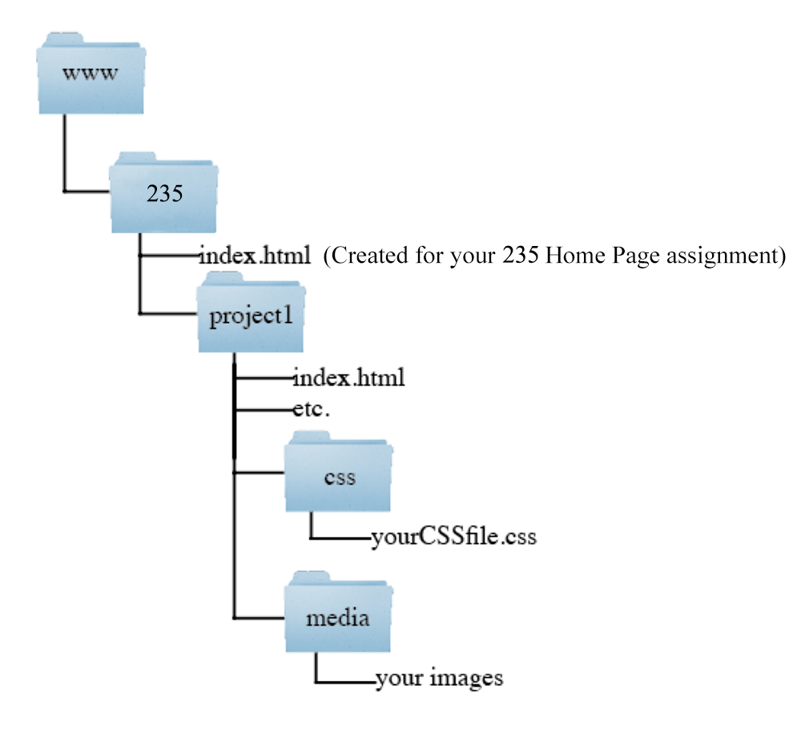

# Project 1 - Portfolio Phase One

One thing that we hear again and again from employers is how essential it is for GDD and NMID students to have a portfolio of "passion projects" (or side projects outside of class) to demonstrate their talent and passion for creating games and interactive experiences. The most common way to let others see these projects is by posting them to the Web in a formal portfolio. 

For Project 1, you will be building the basic structure of your potential future Portfolio. 

It will need to be:
- Responsive.
- Built using Flexbox and CSS Grid.
- Constructed using good "Design Principles" and effective typography.
- Compelling with an initial "landing" that pulls the user in.
	
It will not need to (yet) contain any of your own projects (we're looking forward to Project 2 and 3 to hopefully generate some!).

You may use the following placeholder "project" in place of your own work.  

| Placeholder Game |
|----------|
| Description of the project, technologies and techniques used, my role in the project, description of the project, technologies and techniques used, my role in the project, description of the project, technologies and techniques used, my role in the project, description of the project, technologies and techniques used, my role in the project, description of the project, technologies and techniques used, my role in the project, description of the project, technologies and techniques used, my role in the project, description of the project, technologies and techniques used, my role in the project. |
| For placeholder screenshot images, you may use a web service such as https://placeholder.com or https://picsum.photos/ |
| For placeholder video, there are quite a number of them available on YouTube by just searching for "Placeholder Video"  For example:  https://www.youtube.com/watch?v=ScMzIvxBSi4 (has sound) and https://www.youtube.com/watch?v=eEzD-Y97ges (has no sound) |
| For links, you can make a link that appears clickable but goes nowhere (except back to the same page) by putting "#" in the href attribute.  Prevent the jumping back to the top of the page if you want by using this technique: https://stackoverflow.com/a/33285939 (Involves Javascript) |
	
Aside from the samples of your work, you should add your contact information & resume...

## Overall Requirements
Here is an illustration of the file structure you should use:
  
Your main page for the portfolio site will be the index page for this directory. You must have css and media directories to store the associated files. **Remember:** Our server is case sensitive, so your files **must** use the case indicated in this assignment. If your files are not named and located as instructed, we can't find them, and you will get a 0.

A page named index.html located in the "project1" directory in your 235 directory on banjo that includes
  - A navigation system to allow the user to quickly access distinct content.
  - Your name and an image (could be a photo or an avatar)
  - A *tagline* (see #2 here:https://blog.prototypr.io/10-steps-to-the-perfect-portfolio-website-182b1adcbfc8) - example: "Creative Developer," "Unity/Unreal Game Developer seeking an internship opportunity," etc.
  - "About you" content - example: "I'm a UX/UI Designer and Front End Developer from Sydney, Australia. I enjoy turning complex problems into simple, beautiful and intuitive interface designs. When I'm not coding or pushing pixels, you'll find me in the gym or on the court shooting hoops."
  - Contact information and (optionally) a contact form (check out https://www.makeuseof.com/tag/website-contact-form-google-forms/ for how to use a Google Form for this purpose)
  - A gallery section with very brief information about each of your work examples (For now, use the placeholder provided above, but later, examples can be projects or exercises from this class or other classes, or work you've done on your own). 
  - Individual sub-sections (create 3 identical placeholders for now) with more detail for each of your work examples:
    - Each example needs a title, an image (could be a screenshot, photo, or link to a working demo video), and a one-paragraph description that highlights the tools you used and the skills that it illustrates. If the example is interactive and can play in a Web browser, a link to a working version should be provided.
    - If the example is from a group project, be sure to clearly indicate what your role was on the project
  - Resume (either printer-friendly HTML, or a PDF; **NEVER** a Word doc).  For now, if you don't have one, you can make a dummy link, but begin working on one!
  
## Design Requirements
- The site is [responsive](https://en.wikipedia.org/wiki/Responsive_web_design) and, ideally, a [single-page design](https://en.wikipedia.org/wiki/Single-page_application).  You may use additional pages, but a scrolling portfolio is a more current design and easier to show on a laptop in front of a potential employer.
- It must have a minimum of two well-defined layouts--one optimized for desktop, one for phones, but it should look minimally acceptable at all sizes in between.
- For Project 1, you should avoid the use of a CSS framework such as Bootstrap for layout purposes, however for your updated portfolio at the end of the semester, you are welcome to integrate features of Bootstrap into your design.
- Instead, you should create the initial design using only Flexbox and CSS Grid for layout purposes.
- Employ good Design Principles (as we will cover shortly): clear visual hierarchy, good use of white space, effective alignment of content, thoughtful choices of colors and visual elements.
- Effective typography employed; typeface(s) chosen should be clear and legible as well as appropriate to the content being presented.
- The initial "landing" on the page should be compelling, ideally with a tag line and page design that "pulls" the user in. 
	
## Technology Requirements
- Semantic structural tags like `<header>, <section>, <main>, <nav>`, and `<footer>` should be used appropriately.
- Try to use a consistent structure on your page(s) by repeating many of your design elements - for example: the `<header>, <footer>` and `<nav>` elements should be in the same places on each page/section and have the same colors, fonts and spacing.
- Reasonably valid HTML - Any error or warning that could easily be addressed should be addressed - focus on errors, less on warnings. 
- CSS selectors and rules will be used for formatting and positioning.
- Most (if not all) of the style rules will be located in an external style sheet.
- There will be at least 10 style declarations (rules) in your external style sheet.  Use _class and ID_ selectors as appropriate.
- Utilize custom link styles on all your pages by utilizing the `a:link, a:visited, a:focus, a:hover,` and `a:active` selectors.
- Reasonably valid CSS - see note for HTML above.
- Images and other media are properly optimized (both file size, image format, and image dimensions) for screen display

## Documentation Requirements 
- You are to submit a page of notes (as a link to a separate web page) with information about how you made the site, including the following content: 
- Any notes about the design process (What's your current portfolio goal?  What kind of audience are you going for?  Ideas about what you would like to include?  How are your organizing your content?  Include an image of your design sketch.)
- Source information for any images that you didn't create yourself and any typefaces you use.  
- Notes about the design such as image dimensions you'll need, special notes about how to make updates, things you plan to add for the final version.

## Submission and Due-Date
The site must be placed in the project1 directory inside of your 235 directory (`http://people.rit.edu/youruserid/235/project1/`).  (Later, if you wish to make this portfolio your public portfolio for prospective employers to look at, we recommend that you move it to a different URL (not within your 235 subdirectory, such as http://people.rit.edu/youruserid/portfolio or just http://people.rit.edu/youruserid), but you should wait until you get feedback and a grade for the course)
- You should have a prototype version of your portfolio posted to your banjo account (at the URL above) by the date of the Project 1 Prototype Assignment on myCourses.  Include this link in the comments field.
- ZIP and upload your portfolio files (so far) as well.
- Your final submission must also include the URL to your online documentation in the comments field of the dropbox.

## Grading

The Full Grading Rubric will be attached to the "Final Submission" Assignment.  Here is an overview:
 
  Requirement | Possible Points (100%) |
----------- | --------------- |
Required content present | 15% |
Responsive Design | 15% |
Visual Design | 10% |
Typography | 10% |
Navigation System | 10% |
Semantic, valid HTML | 10% |
Well-structured, valid CSS | 10% |
Documentation | 10% |
File Structure | 5% |
Properly optimized media | 5% |

## Future version notes:
Later (at the end of the semester), you will add:
- Real work examples.
- Your Resume if you didn't add it previously.
- Any additional design elements and/or interactivity that you wish to add.

Also:
- You should correct, adjust, and/or improve (if possible) any elements that were noted by your TA or Instructor in your evaluation and/or video feedback.
- You should consider *removing* your documentation link if it doesn't present your portfolio design in the best light.
- You should be prepared to move your portfolio to a better URL.

	
	
	
