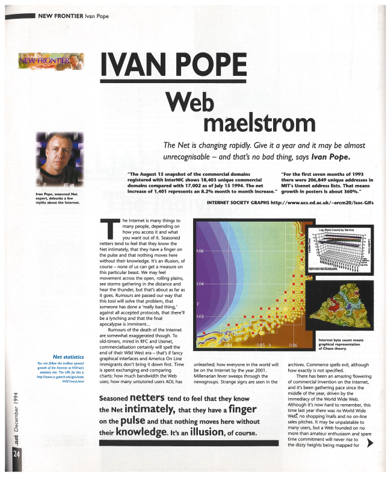

# Project 1 - "One Page" Responsive Website (in two parts)

For this project, you will select an appropriate topic (a list is below) and create a website beginning with a "build to spec" phase followed by an "adapt to content" phase.

## About the Overall Project

### Potential Topics for this project:
- a personal web portfolio.
- a web page that supports a personal project.
- an in-depth page about a personal pursuit such as a favorite game, hobby, or cause.
- something else that you've discussed with your instructor in advance (send a Direct Message to your instructor via Slack to get the 'ok' for the topic).  The scope of the topic and the existance of visual media to use on the page are key factors.

### FINAL Project 1 General Requirements:
- It must be a "one-page" site (see [this article](https://www.web.com/blog/start/website-design/website-battles--one-page-website-vs-multi-page-website) for a discussion of the pros and cons of one-page vs. multi-page websites) that you scroll up and down through to see the _majority_ of the content.
  - It is allowed to create a few "more info" type pages that support information that is already introduced and visible on the main page.  Just a "thumbnail" link from the front page to a deeper page with the "real information" is not acceptable.
- It must include a navigation system that allows the user to automatically scroll up and down the page by clicking navigation links/elements.
- The page must be responsive to mobile widths with a layout that changes (not just stretches/squishes) between desktop and mobile.  It must also not get overly wide (set a maximum width as well). 
- It must use Flexbox and/or CSS Grid for layout purposes.  No usage of CSS Frameworks for this project.
  - It would be acceptable to use a simple CSS reset file, but not Marx or other (although simple) frameworks.
- A documentation page (doc.html) must be maintained throughout the process, details below.
- Files will be stored in a pre-defined file structure:

Here is an illustration of the file structure you should use:  

### FINAL Design Expectations:
- Your page must ultimately have a pleasing layout and design that demonstrates:
  - All four so-called ["CRAP" principles](https://learning.oreilly.com/library/view/the-non-designers-design/9780321563088/ch01.html#ch01lev1sec1).
  - Clear visual hierarchy, good use of white space.
  - Thoughtful choices of colors and other visual elements.
  - Effective typography with typefaces that are clear, legible, and appropriate for the content.
  - An appropriate custom link style (visible somewhere on the page -- put a small link in the footer if you don't have another place to use it)
- The user visiting your page should experience a compelling initial "landing" that pulls them in and orients them to where they are and where they can go.

### FINAL Content Requirements
- Include multiple images of at least two different sizes.  They should be relevant to the chosen topic, of course.
- Demonstrate some kind of layering, such as a background behind a foreground element, or text that appears over an image.  A colored background behind text is not enough to meet this requirement.
- All text must be added as actual text characters in the HTML, no adding text to an image with Photoshop.
- Your final design must "adapt" to accomodate as much information as necessary to fully cover your subject (see more in the "Phase 2" expectations).

## About the Two Separate Parts/Phases

### What's required for Part 1 (the "build to spec" phase)

Web developers commonly work in a team with others such as Content Strategists, User Experience designers, and Graphic Artists.  For the first phase of this project, we will simulate that by asking you to recreate a design that some other Graphic Artist has already created and "published" in print.  It's not always true that a printed design can be fully reproduced on the web, especially when you start to take varying browser and device sizes into account.  But for this first phase of the Project, you should aim to get as close to the printed design as you possibly can, while still thinking about how your page will need to adapt in the 2nd phase to add responsiveness and greater page length as you pour your own content into it.

#### What to do:
1. Select one of these pre-chosen page layouts:  
    
   
	- Each of the above images is a link to a pdf version of the layout.  You can go ahead, download this pdf and edit it as necessary to indicate your layout plans (see below) -- also, include this pdf in your src subfolder & include it as a link in your doc.html
	- You're also welcome to submit your *own* pdf as part of your proposal (See [tips below about what's "challenging" enough](#whats-challenging-enough-for-a-phase-1-layout)).
	- A Slack Channel specifically for extra Project 1 questions & guidance (and maybe some additional "pre-chosen" layouts) can be found in the course Slack workspace. Look for the channel named #project-1
1. Mirror (as closely as possible) the design of your chosen design/PDF through HTML & CSS.
	1. Start by sketching (perhaps by drawing right over your starting image) where your grid lines are going to go.  If you can, save this sketch and include it in your documentation.
	1. Build an HTML file (call it spec.html) that will work well with your sketched out plan... Add special sections, divs, figures, etc.  Whatever you need.  Think semantically as often as possible.  Include ids and classes that will work well with the style rules you need to write.
    	- Don't copy the body text word for word, use ["lorem ipsum"](https://www.justinmind.com/blog/awesome-lorem-ipsum-alternatives/) text where you have blocks of words to fill in. 
  	1. Write the CSS (including, early on, the Grids and Flexbox containers that you'll need).  Make sure to get sizes on your images quickly, too.
    	- You don't need to use the exact images from your design, but similar ones would be best.  Do your best to select a similar font, color scheme, and matching layout.
1. Create a Documentation page and include as much of the information listed in the "Documentation Requirements" section below as you can.
1. Determine (how your page should adapt to narrower layouts). 
	- Sketch a plan for what will go where when the page is narrower.  This can be mocked up in an image editor or drawn on paper and photographed with a cell phone.  You'll include this on your Documentation page.
	- Optionally, you can begin to implement a mobile version of your spec at this stage.  We primarily care about the wider layout at this time, however.
1. Submit everything to the assignment dropbox:
	- A zip of all of your project 1 files (including everything in the directory structure above).
	- A direct link to your "source" PDF that you've put into your project 1 directory on banjo (so that we can easily compare before and after).
	- A direct link to your "spec.html" page. (once submitted, you should make no further changes to the spec.html or the CSS that styles it -- we will want to compare it to your FINAL project 1 page.)
	- A direct link to your "doc.html" page which must (among other things) include the image of your sketched plan for how to add responsiveness to your page.

#### What's Challenging Enough for a Phase 1 layout?
- It should be from a print-based source (exceptions at the discretion of your instructor).  No existing HTML version should already exist. It should not be a PDF screenshot of an existing web page (unless, again, at the discretion of your instructor)
- The design should have a 1 or 2 column layout that makes some sense for web page design.  (typical multicolumn newpaper layouts do not, unless each column starts something new and are not just a continuation of a long article over multiple columns). 
- Should include images in the layout in at least 2 different sizes.  The images ideally would have some kind of additional 'feature' such as overlapping text, other graphic elements behind or overlapping, drop shadows, rotation, text that flows around, etc.
- Typography in several styles.  Headings (perhaps in a different font), section headings, line-spacing changes, different colors and backgrounds, are all nice features to try to emulate.
- Should have potential to be made "responsive"... You'll plan out in a sketch what will go where when the page gets narrower... All content should still be present, but incidental images may disappear or resize, order of information may change, etc.
	- Consider how the design will "lengthen" as the page becomes taller with more content/articles/sections.

### What's required for Part 2 (the "adapt to content" phase)

For Phase 2, you'll copy your spec.html file to index.html and make changes as appropriate with new text content, images, colors, and appropriate layout modifications/additions to work well with your chosen content.

1. You've already thought about the responsive part and submitted a plan with Part 1
	- Use Media Queries to enable and disable CSS as appropriate to make the page adjust it's layout at different sizes.
	- An excellent project will look good any any width from "desktop wide" to "mobile narrow", but we're mostly interested that a version at mobile phone width still works well and provides all content that a desktop version has.
	- Consider how the design will "lengthen" as the page becomes taller with more content/articles/sections.
2. Put your own content into the design.
3. Make sure that the initial spec.html design does not change as you work on your new index.html version.  If you want to make sure of this, start using a new copy of your .css file (changing the link to the external css in your index.html).
4. Change anything you want to about your site design.  The final version will stand on its own merits, but it shouldn't be a drastically "simplified" version of the previous phase.  
5. Keep your doc.html file updated as you work, make note of big changes and areas that required a lot of extra effort.
6. When complete, submit another zip of your finished work and all required links in the Project 1 Part 2 assignment dropbox.

	
## What's required in BOTH PHASES?

### Technology Requirements
- Semantic structural tags like `<header>, <section>, <main>, <nav>`, and `<footer>` should be used appropriately.
- Reasonably valid HTML - Any error or warning that could easily be addressed should be addressed - focus on errors, less on warnings. 
- CSS selectors and rules will be used for formatting and positioning.
- Most (if not all) of the style rules will be located in an external style sheet.
- There will be at least 10 style declarations (rules) in your external style sheet.  Use _class and ID_ selectors as appropriate.
- Utilize custom link styles on all your pages by utilizing the `a:link, a:visited, a:focus, a:hover,` and `a:active` selectors.
- Reasonably valid CSS - see note for HTML above.
- Images and other media are properly optimized (both file size, image format, and image dimensions) for screen display

## Documentation Requirements - doc.html
- a link to the Original Design Source PDF (whether it was provided or chosen by you)
- Your sketch of layout grid (if you made one) and the sketch of you intended mobile/narrow version.
- a link to your spec.html file.
- Include links to all resources (images used, sources of written content if not yourself, fonts used, tutorials referenced, etc).
- Describe the 'goal' for your site, who is your audience, and how these informed your choices about design/organization.
- Any other notes about your project that you'd like to draw our attention to... Especially challenging parts?  Ways in which you went 'above and beyond' expectations?  Other notes?

## Submission and Due-Date
The site _must_ be placed in the project1 directory inside of your 235 directory (`http://people.rit.edu/youruserid/235/project1/`).  (Later, if you made a portfolio, and you wish to make this public for prospective employers to look at, we recommend that you move it to a different URL (not within your 235 subdirectory, such as http://people.rit.edu/youruserid/portfolio or just http://people.rit.edu/youruserid), but you should wait until you get feedback and a grade for the course -- if you can't wait, make a copy of it to put at the other URL)
- You should have a "prototype" version of your Phase 2 posted to your banjo account (at the URL above) by the date of the Project 1 Prototype Assignment on myCourses.  Include this link in the comments field. If you are in an in-person section of the course, time in class will be set aside for students to critique either other's work so far.  If you are in an online section of the course, you'll be expected to post this URL to an online "Crit Group" in Slack.  See your section specific channel for more details about this if it applies to you.
	- ZIP and upload your portfolio files (so far) as well.

## Grading

The Full Grading Rubric will be attached to the "Final Submission" Assignment when it becomes available.  Here is an overview:
 
  Requirement | Possible Points (100%) |
----------- | --------------- |
Phase 1 "Built to Spec" | total to 40% |
Successful Design Layout Implementation  | (10%) |
Typography Matching Design | (10%) |
Responsive Design Planning | (10%) |
Semantic, valid HTML & CSS in spec.html | (10%) |
Phase 2 "Adapted to Content" | total to 60% |
Responsive Design Functional | (10%) |
Final Visual Design Suitable, incl. Layered Elements | (15%) |
Navigation System Implemented | (10%) |
Custom Link Colors somewhere on page | (5%) |
Semantic, valid HTML & CSS in index.html | (10%) |
Documentation at doc.html | (10%) |
